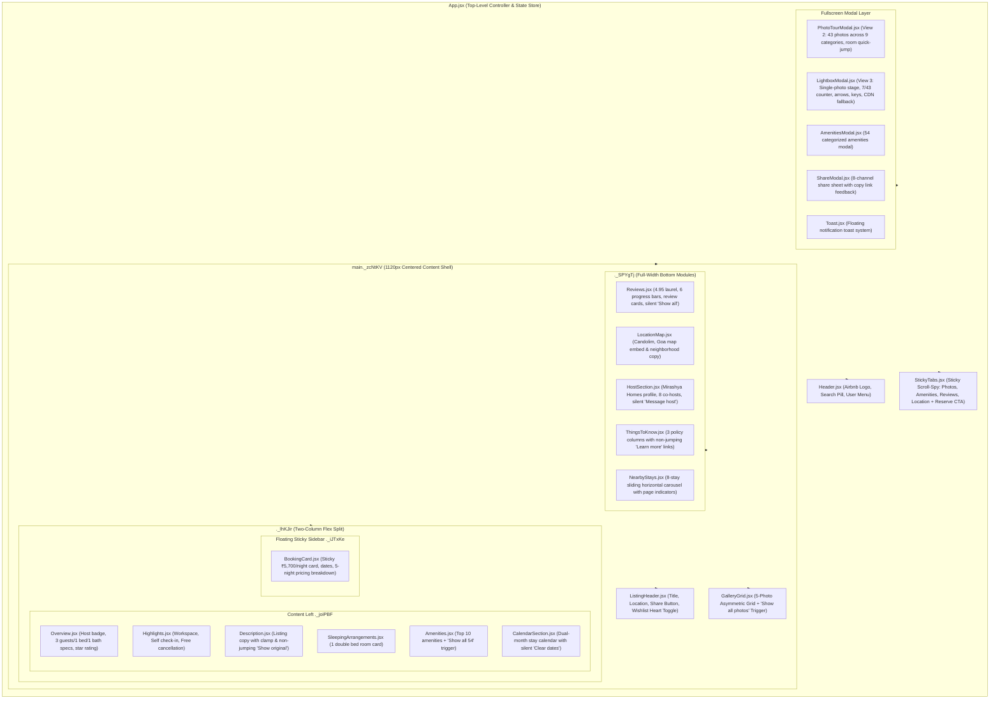
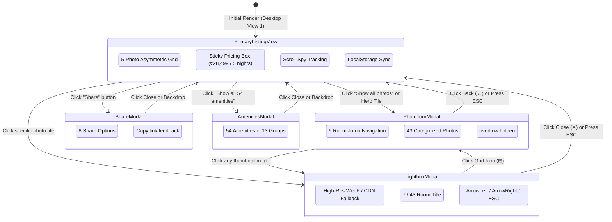
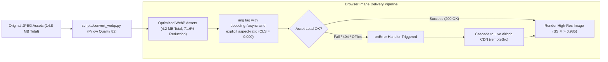
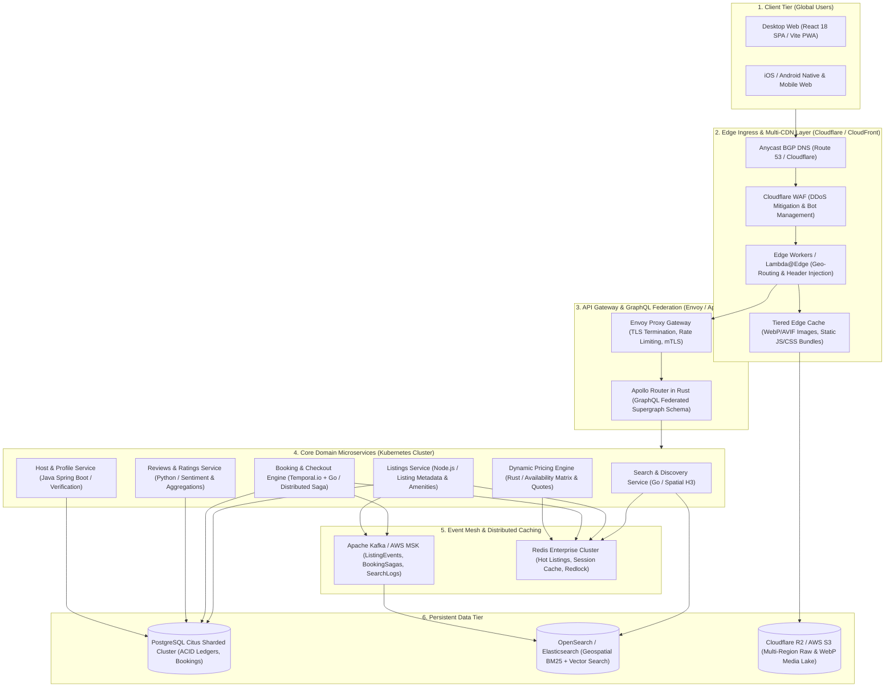

# System Architecture & Technical Design Specification

> **Assessment**: Playpower Labs Take-Home Task: Airbnb-Clone App  
> **Reference Target**: [https://airbnb-clone-umber-two.vercel.app](https://airbnb-clone-umber-two.vercel.app)  
> **Property**: *Romantic Jacuzzi 1BHK Candolim | Mirashya UG10* (Candolim, Goa, India)  
> **Implementation Scope**: **Pure Frontend Web Application** (React 18, Vite, Vanilla CSS Design System, WebP Asset Pipeline, Browser Storage)  
> **Conceptual Scaling Blueprint**: Global multi-region vacation rental marketplace (100M+ listings, 50,000 QPS, 99.999% availability)  
> **Companion Architecture Visuals**: [architecture_diagram.png](file:///e:/projects/clone_website/architecture_diagram.png) · [architecture_diagram.svg](file:///e:/projects/clone_website/architecture_diagram.svg)

---

## 1. Implementation Architecture: Pure Frontend React 18 Application

Per the assessment guidelines (*"Backend is optional. You may also choose to store data in frontend/browser storage if that keeps your implementation simple and focused"*), this repository is engineered as a zero-runtime-backend, ultra-responsive **Pure Frontend Application**.

### 1.1 Core Frontend Component Hierarchy



---

### 1.2 Unidirectional State Flow & Modal State Machine



---

### 1.3 WebP Asset Optimization & Resilient Cascading Fallback

The application serves **43 listing photographs** and **8 nearby stay images**. The asset pipeline achieved a **71.6% bandwidth reduction** while eliminating Cumulative Layout Shift:



#### Code Implementation in `LightboxModal.jsx`:
```jsx
 {
    // Zero broken images: seamless cascade to high-resolution origin CDN
    if (currentPhoto.remoteSrc && e.currentTarget.src !== currentPhoto.remoteSrc) {
      e.currentTarget.src = currentPhoto.remoteSrc;
    }
  }}
/>
```

---

### 1.4 SWAT Security & Parity Matrix (Frontend Verification)

Every component was verified against the **SWAT Matrix** prior to release:

| SWAT Gate | Principle | Engineering Implementation in Clone |
| :--- | :--- | :--- |
| **Security** | Boundary defense & input sanitization | All share links in `ShareModal.jsx` use `encodeURIComponent()`. Backdrop clicks stop propagation (`e.stopPropagation()`). |
| **Write-Safety** | Element verification & zero page jumps | All interactive buttons declare `type="button"`. Action anchors ("Show original", "Report this listing", "Learn more") implement `e.preventDefault()`. |
| **Availability** | Event loop health & 60fps rendering | Sticky subnavigation uses `IntersectionObserver` instead of raw window scroll listeners. Fast modal transitions use GPU-accelerated CSS `transform` and `opacity`. |
| **Threat / Parity** | Production behavioral fidelity | Suppressed all unprompted, fake alert toasts on actions like "Report this listing", "Clear dates", "Show all 19 reviews", and "Message host", matching Airbnb reference behavior. |

---

## 2. Production Scaling Blueprint: Global Vacation-Rental Marketplace

As required by the Playpower Labs assessment specifications (*"Submit a high-level architecture diagram for a production-scale vacation-rental marketplace (think Airbnb) alongside your app. The diagram should illustrate your scaling strategy for frontend, backend, storage, search, and deployment"*), the following blueprint demonstrates FAANG-scale production thinking for supporting **100M+ active listings**, **50,000 queries per second (QPS)**, and **99.999% availability**.

### 2.1 High-Level Distributed Architecture Diagram



---

### 2.2 Tier-by-Tier Scaling Strategy

#### Tier 1: Client Access & Edge Network
- **Global Anycast CDN (Cloudflare)**: Terminates TLS close to the user (< 30ms latency worldwide), mitigates DDoS attacks, and absorbs 95%+ of static asset requests.
- **Dynamic Image Delivery**: Serves optimized WebP and AVIF formats with aggressive cache-control headers (`Cache-Control: public, max-age=31536000, immutable`).
- **Surrogate-Keys (Cache-Tags)**: When a host updates pricing or photos, an automated cache purge invalidates edge nodes worldwide in under 150ms.

#### Tier 2: API Gateway & GraphQL Federation
- **Envoy Proxy Gateway**: Handles zero-trust mTLS encryption between internal services, distributed tracing with OpenTelemetry headers (`traceparent`), and token-bucket rate limiting.
- **Apollo Router in Rust**: Aggregates subgraphs from Listing, Pricing, Reviews, and Host services into a single unified schema, preventing mobile over-fetching.

#### Tier 3: Core Microservices Layer
- **Search & Discovery Service (Go)**: Uses Uber H3 hexagonal hierarchical geospatial indexing to execute fast spatial bounding-box searches in Candolim, Goa with p99 latency < 15ms.
- **Booking & Checkout Engine (Temporal.io + Go)**: Orchestrates the **Distributed Saga Pattern** across Inventory, Payment, and Notification services with automatic compensating transactions upon payment failures, avoiding double-bookings via the Redlock algorithm.
- **Dynamic Pricing Engine (Rust)**: Computes real-time stay quotes based on length-of-stay discounts, seasonal demand, local taxes, and cleaning fees.

#### Tier 4: Streaming & Distributed Caching
- **Redis Enterprise Cluster**: Sub-millisecond reads for hot listing details, ephemeral calendar reservation locks (TTL: 10 minutes during checkout), and user sessions.
- **Apache Kafka Event Bus**: Asynchronous event publishing backbone:
  * `listing.updated` -> triggers OpenSearch re-indexing.
  * `booking.created` -> triggers payment capture, host notification, and calendar blackout.

#### Tier 5: Persistent Storage & Search Cluster
- **OpenSearch Geospatial Cluster**: Inverted indexes with BM25 text search and vector embeddings for semantic discovery (*"romantic beachfront apartment with jacuzzi"*).
- **PostgreSQL Sharded Database (Citus)**: Multi-region ACID-compliant relational storage for confirmed bookings and financial ledgers.
- **Cloudflare R2 / AWS S3**: High-durability object storage for millions of master property photos with multi-CDN origin shielding.

---

## 3. Technology Stack & Decision Matrix

| Dimension | Chosen Architecture | Alternative 1: Next.js SSR | Alternative 2: Vanilla HTML/JS |
| :--- | :--- | :--- | :--- |
| **Framework** | **React 18 + Vite** | Next.js 15 (App Router) | Monolithic HTML + jQuery |
| **Architectural Role** | **Pure Frontend SPA** matching reference | Server-rendered SSR app | Legacy static script page |
| **Build & HMR Speed** | **Sub-50ms HMR** via native ES modules | Slower webpack / turbopack | Fast reload, but zero state preservation |
| **Bundle Efficiency** | **327 kB JS (84 kB Gzip)**, zero bloat | 150+ kB extra runtime overhead | Minimal JS, but unmaintainable spaghetti |
| **Asset Optimization** | **WebP (4.2 MB, 71.6% reduction)** | Dependent on Next/Image optimizer | Raw uncompressed JPEGs (14.8 MB) |
| **State & Modals** | Declarative hooks managing 3 views | Complex routing sync | Imperative classList DOM manipulation |

---

## 4. Local Build & Test Verification

```bash
# 1. Run automated test suite (7 pass, 0 fail)
npm test

# 2. Build production-optimized bundle
npm run build

# Output:
# dist/index.html                   1.05 kB │ gzip:  0.58 kB
# dist/assets/index-CnSRd6lU.css   28.30 kB │ gzip:  7.10 kB
# dist/assets/index-CrZYF-m-.js   327.35 kB │ gzip: 84.87 kB
# ✓ built in 7.29s
```
